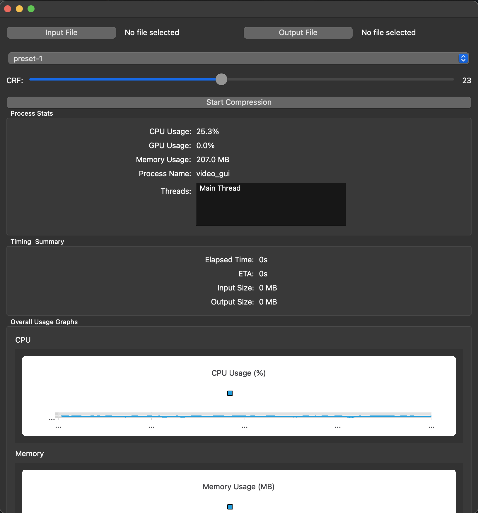
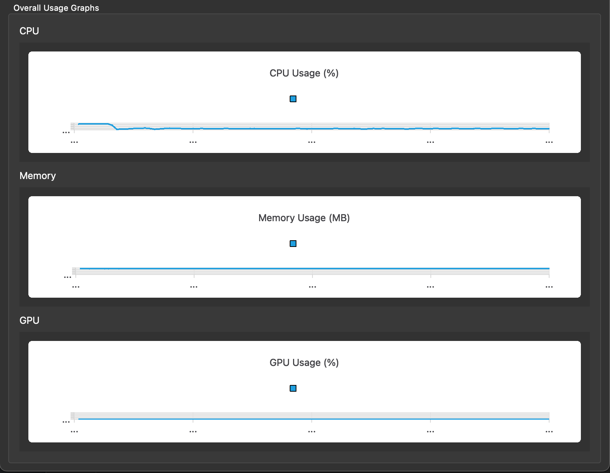

# Video Compression using OpenCL

**Video Compressor OpenCL** is a cross-platform (macOS & Windows) video compression application with a Qt6-based GUI. It features real-time monitoring of CPU, memory, and (if available) GPU usage during compression, leveraging OpenCV and OpenCL for backend processing.

---

## 🚀 Demo

<!-- Place your GUI demo GIF or screenshot here -->


---

## Features

- Compress videos using GPU acceleration (OpenCL + OpenCV)
- Real-time charts for CPU, memory, and GPU (if available) usage
- Intuitive Qt6 GUI with sliders, file pickers, and live stats
- Cross-platform: tested on macOS (Apple Silicon/Intel) and Windows 10/11

---

## Build Instructions

### macOS

**Prerequisites:**

- [Homebrew](https://brew.sh/)
- Qt6 (`brew install qt6`)
- OpenCV (`brew install opencv`)
- OpenCL (`brew install opencl-headers`)
- CMake (`brew install cmake`)
- (Optional) FFmpeg for extended codec support (`brew install ffmpeg`)

**Steps:**

```sh
# Clone this repository
git clone https://github.com/TarunZach/video_compression_opencl
cd video_compression_opencl

# Create a build directory
mkdir build && cd build

# Configure the project (adjust path if Homebrew is not default)
cmake .. \
    -DCMAKE_PREFIX_PATH="$(brew --prefix qt6)/lib/cmake/Qt6" \
    -DCMAKE_BUILD_TYPE=Release

# Build with all cores
make -j$(sysctl -n hw.ncpu)
```

**Run the GUI:**

```sh
./video_gui
```

---

### Windows

**Prerequisites:**

- [Qt6](https://www.qt.io/download) (Qt 6.x, ensure "Qt Charts" module is included)
- [OpenCV for Windows](https://opencv.org/releases/)
- CMake (from [cmake.org](https://cmake.org/download/))
- Visual Studio 2019/2022

**Steps:**

1. **Clone this repo and open a "x64 Native Tools Command Prompt" or use CMake GUI.**
2. **Configure:**

   - Ensure `Qt6_DIR` and `OpenCV_DIR` are set to your installed paths.
   - If using the command line:

     ```sh
     mkdir build
     cd build
     cmake .. -DCMAKE_PREFIX_PATH="C:/Qt/6.6.1/msvc2019_64/lib/cmake;C:/opencv/build/x64/vc16/lib"
     ```

3. **Build:**

   - Use either CMake GUI "Generate" + "Open in IDE" + Build,
   - Or, in the command line:

     ```sh
     cmake --build . --config Release
     ```

**Run the GUI:**

```bat
.\Release\video_gui.exe
```

or double-click `video_gui.exe` from the build directory.

---

## Usage

1. **Open the application.**
2. **Click "Input File"** to select a video.
3. **Click "Output File"** to choose save location (use `.mp4` or `.mkv` etc.).
4. **Adjust CRF and preset as needed.**
5. **Press "Start Compression".**
6. **Watch CPU, memory, and (if supported) GPU usage graphs update in real-time.**

---

## Notes

- **GPU usage:** macOS does **not** provide per-process GPU stats; chart will show "N/A".
  Windows support for GPU monitoring is planned (or via vendor tools/APIs).
- **Output file extension:** Always specify a standard video extension (e.g., `.mp4`).

---

## Troubleshooting

- If you see blank charts or GUI freezes, ensure you’re using Qt6 and OpenCV built for your platform/architecture (ARM64 vs x86_64).
- For missing DLL errors on Windows, ensure all Qt and OpenCV DLLs are in your `PATH` or copied next to the executable.

---

## 📸 GUI Preview

<!-- Replace the image path below with your GIF or screenshot -->




---

## License

MIT License © 2025
Tarun Zacharias Akkarakalam
Can Özkan
Wonil Choi
